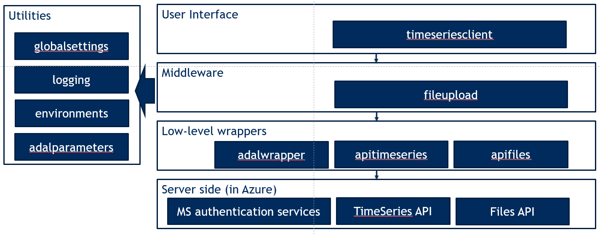

Developer
=========

Logging and Debugging
#####################
Sometimes, when things go wrong you would like to gain some insight in what is
happening in the background. The timeseriesclient package uses pythons built-in
logging package, see the full documentation here: `https://docs.python.org/2/howto/logging.html <https://docs.python.org/2/howto/logging.html>`_.

To turn on logging there are a two steps you have to perform:

#. Set the debug level 
#. Add a logging handler

Architecture
############

